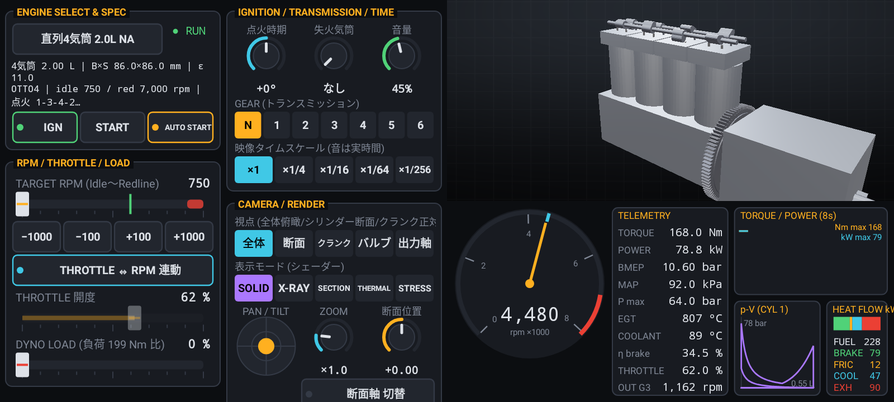
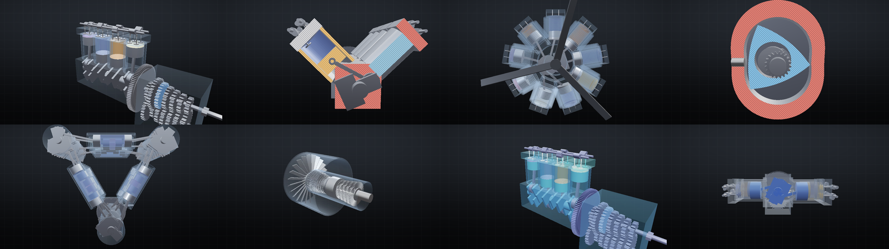

# 3D Engine Full Simulator (Android)

内燃機関・外燃機関・ロータリー・ガスタービン・電動機の **運動機構 / 熱力学 / 物理音響** をリアルタイムに再現する Android アプリ。
3D モデルは直接触らず、計器盤風の **操作コンソール** だけで運転とカメラを操作する。





- 仕様書: [docs/SPEC.md](docs/SPEC.md)
- 収録: 43 機種 (直列 1〜8 / V2〜V16 / 水平対向 / 星型 3〜28 気筒 / ヴァンケル 1〜4 ローター / デルティック・Jumo 205 / 蒸気機関 / スターリング / ターボジェット・ファン・シャフト / PMSM・誘導モータ)
- 機種は `app/src/main/assets/engines/*.json` を追加するだけで増やせる (スキーマは仕様書 §6)
- **n 気筒設計**: 直列/V/水平対向/星型/対向ピストン/ロータリーを任意の気筒数で生成 (等間隔点火のクランク配置を自動設計)
- **駆動モード**: 台上 (ダイナモ) / MT / **AT (トルコン + ロックアップ + キックダウン)**、アクセルペダルボタン
- **描画**: Vulkan (既定) / OpenGL ES 3.0 (自動フォールバック)
- **ENGINE EMPIRE**: 同じ物理エンジンで動く放置・育成ゲーム (ランチャーに別アイコン)。実出力 − 燃料代が収入になり、エンジンごとの回転域・効率・過給特性がそのまま攻略要素になる


## ビルド

```sh
# Android SDK (platform 36, build-tools 36, NDK 29.0.14206865, CMake 3.31.6) が必要
./gradlew assembleDebug        # app/build/outputs/apk/debug/app-debug.apk
./gradlew assembleRelease      # デバッグ鍵で署名したリリースビルド
```

GitHub Actions (`.github/workflows/android.yml`) でも APK が成果物として生成される。

## テスト

```sh
# ネイティブコア (キネマティクス/熱力学/音響) をPC上で検証
cmake -S tests -B tests/build -G Ninja && cmake --build tests/build && ./tests/build/host_tests
./tests/build/host_tests --wav            # 各機種の音を WAV 出力 (出力先はソース内のパス)

# ゲーム経済のバランス確認 (全エンジンを自動ダイナモで定常運転)
./tests/build/game_balance
./tests/build/game_balance app/build/game_tuned/*.json   # GameTest が書き出す全強化機

# 実機と同じレンダラを Mesa で描画してスクリーンショット (Vulkan=lavapipe+検証レイヤ / GLES=EGL サーフェスレス)
# glslc (NDK の shader-tools) と Vulkan/EGL 開発パッケージがある場合のみビルドされる
./tests/build/render_shots <outdir> v8_cross --vk 0 0 2 1   # <mode preset>... (mode: 0 solid 1 xray 2 section 3 thermal 4 stress)
./tests/build/render_shots <outdir> i4_20t --vk --fx 0 0     # ゲーム演出 (炎・火花)

# コンソール UI のレイアウト (Robolectric, ネイティブ不要) → app/build/screenshots/
./gradlew testDebugUnitTest
```

## 構成

| パス | 内容 |
|---|---|
| `app/src/main/cpp/core` | JSON パーサ、エンジン定義 (レイアウト展開) |
| `app/src/main/cpp/sim` | 厳密キネマティクス、熱力学・動力学シミュレーション |
| `app/src/main/cpp/audio` | 物理音響合成 DSP、Oboe 出力 |
| `app/src/main/cpp/render` | 手続き的メッシュ、シーン、PBR/X線/断面/ヒートマップ描画、カメラ |
| `app/src/main/cpp/jni` | Kotlin との境界 |
| `app/src/main/cpp/render/vk` | Vulkan バックエンドと GLSL 4.50 シェーダ |
| `app/src/main/java/.../` | 操作コンソール UI、テレメトリ、Vulkan/GL ビュー、n 気筒設計 |
| `app/src/main/java/.../game` | ENGINE EMPIRE (モデル・ゲームループ・HUD) |
| `tests/` | ホストテスト、ヘッドレス描画 |
