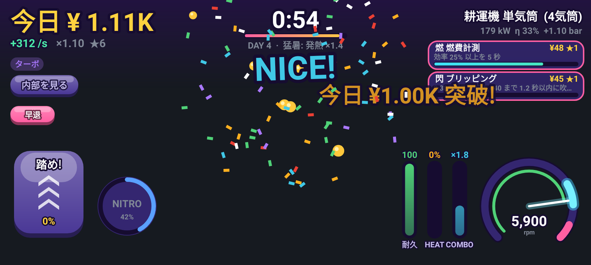
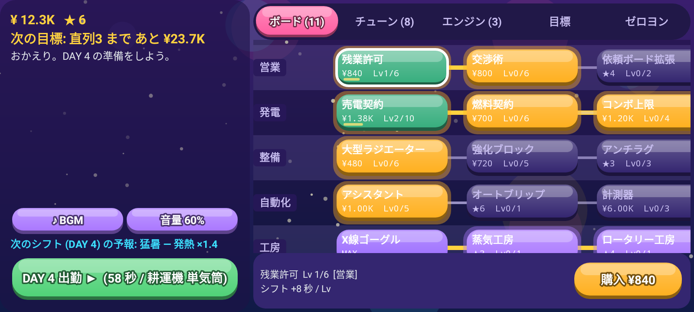

# 3D エンジン・フルシミュレーター 仕様書 v3 (Android APK)

> 本書は初版仕様書を実装可能な粒度まで具体化・修正した改訂版である。
> 各項の「実装」欄はリポジトリ内の該当ソースを示す。数式・定数は実装と一致させている。

---

## 0. 初版からの主な変更点 (改善理由)

| # | 初版の記述 | 問題点 | 改訂内容 |
|---|---|---|---|
| 1 | ピストン運動は「単振動＋高調波」 | 2 次高調波までの近似は λ=r/l≈0.3 で約 1% の誤差があり、星型のアーティキュレーテッドロッドには適用できない | **閉形式の厳密解** `s = q·u + √(L² − |q|² + (q·u)²)` を全機構で使用 (§3.1) |
| 2 | RPM スライダとスロットルが両方とも入力 | どちらが主入力か未定義 (制御が衝突) | **ガバナ連動モード** (RPM 指令 → PI 制御がスロットルを操作) と **直接スロットルモード** をトグルで排他切替 (§2.3) |
| 3 | 60fps でそのまま描画 | 6000rpm = 100 回転/秒。1 フレームで 10 回転し、車輪が止まって見える現象 (ストロボ効果) で機構が視認不能 | **映像タイムスケール** (×1〜×1/256) を追加。物理と音は実時間のまま、映像のみハイスピードカメラ的に減速 (§3.4) |
| 4 | Filament / Unity の二択 | Unity は APK 肥大化・ライセンス、Filament は断面ステンシル制御とマテリアル事前コンパイル (matc) が必要 | **C++20 + OpenGL ES 3.0 自前レンダラ** に確定。ステンシル・クリップ平面を直接制御でき、同一コードを PC 上でヘッドレス検証可能 (§4) |
| 5 | FMOD / Faust | FMOD は商用ライセンス、Faust はビルド系が増える | **自前 C++ DSP + Oboe**。依存を Oboe のみに削減 (§5) |
| 6 | 点火は「DIRAC インパルス」 | 48kHz でのデルタ列はエイリアシングしクリック音になる | **ブローダウン継続時間 (約 90°CA) を持つ帯域制限パルス** に変更。振幅は熱力学モデルの排気弁開時シリンダ圧から決定 (§5.2) |
| 7 | 熱流/応力ヒートマップ | 何を可視化するか未定義 | 熱力学モデルの **燃焼ガス温度・部品温度** と、**ガス力＋往復慣性力による軸力** を直接色付け (§4.4) |
| 8 | エンジン種別「全網羅」 | データ構造が抽象的で実装不能 | **JSON レイアウト記述 → 汎用機構 (クランク/スロー/ピストン/燃焼室) への展開** を定義。43 機種を収録 (§6) |
| 9 | タービン/モータにも「RPM」 | 意味が不明確 | タービンは **N2 (高圧スプール)**、モータは **ロータ回転数** を主回転数と定義 |
| 10 | 横画面固定 | Android 16 以降、sw600dp 以上の大画面では向き固定・リサイズ不可指定が無視される [出典](https://developer.android.com/about/versions/16/behavior-changes-16) | 縦長ウィンドウでは「上段=ビューポート|テレメトリ / 下段=コンソール」に自動再配置 (§2.1) |
| 11 | オーディオスレッドの排他制御 | 「排他実行」はロック前提と読め、音切れの原因になる | オーディオスレッドは **ロック・メモリ確保を一切行わない**。共有値は atomic、構成差し替えは atomic ポインタ交換 (§7) |
| 12 | 圧縮機/ファンの翼通過音 | ファン以外は可聴域 (20kHz) を超える (例: 28 枚 × 16500rpm ≈ 7.7kHz、ターボ 11 枚 × 190krpm ≈ 35kHz) | 可聴域を超える成分は **オクターブ折返し** で音程変化だけを残す (聴感上の表現であることを明記) |

### 0.1 v3 の追加 (第 2 次要望)

| # | 要望 | 実装 |
|---|---|---|
| 13 | 気筒数を自分で決めたい | **n 気筒設計ダイアログ**: 直列 1〜16 / V 2〜24 / 水平対向 2〜16 / 星型 3〜11 気筒×1〜4 列 / 対向ピストン 1〜12 / ヴァンケル 1〜4 ローター。ボア・ストローク・ロッド比・圧縮比・回転域・サイクル (4 スト/2 スト/ディーゼル)・過給を指定。クランクピンは **等間隔点火** になるよう自動設計 (§3.7)。端末内に保存しカタログに追加 |
| 14 | アクセル踏み込みボタン | **ペダルボタン**: 押した位置 (下ほど深い) が目標開度。実ペダル同様に踏み込み 3/s・戻し 5/s の速度制限。踏んでいる間はガバナ連動を一時解除 |
| 15 | オートマモード | **駆動モード 台上 / MT / AT**。車両モードでは縦方向の車両運動 (質量・転がり・空気抵抗・勾配・ブレーキ) を解き、AT は **トルクコンバータ + ロックアップ + シフトスケジュール (キックダウン付き)**、MT はオートクラッチ (§3.8) |
| 16 | Vulkan 化 | 描画を **API 非依存フロントエンド + Vulkan バックエンド** に分割。Vulkan 非対応/初期化失敗端末は GLES 3.0 に自動フォールバック (§4.1) |
| 17 | エンジン特性を活かしたインクリメンタルゲーム (別アプリ扱い・演出増し) | **ENGINE EMPIRE**: 別アプリ (別パッケージ・別アイコン) として配布。昼のシフト ↔ 夜のガレージのサイクル型 (v0.6)。シミュレータの物理をそのまま「発電所」として使い、実出力・熱効率・回転域がゲーム性になる。炎/火花/煙/閃光/シェイク等の演出を追加 (§10) |

---

## 1. システム概要

内燃機関・外燃機関・ロータリー・ガスタービン・電動機の **運動機構・熱力学・音響** をリアルタイムに再現する Android アプリ。
3D モデルへの直接タッチ操作は持たず、実機の計器盤を模した **操作コンソール** で運転とカメラを制御する。

### 1.1 目標性能

| 項目 | 目標 |
|---|---|
| 描画 | 60fps (GLES 3.0, 4xMSAA, ノード数 ≤ 300) |
| 物理 | 実時間。燃焼室あたりクランク角 1° (17 室以上は 2°) 刻みのサブステップ |
| 音 | Oboe 低遅延ストリーム、バッファ = 2 バースト (一般に 10〜20ms) |
| 対応 | Android 8.0 (API 26) 以上、arm64-v8a / x86_64、16KB ページサイズ端末 |

### 1.2 非目標

- CFD (流体の空間分布) は解かない。燃焼室は単一ゾーン (空間一様) モデル。
- 車両運動 (タイヤ・車体) は扱わない。負荷はダイナモ (または プロペラ吸収) で与える。

---

## 2. 画面レイアウト & UI

### 2.1 レイアウト

```
横長 (基準)                                      縦長 (大画面で向き固定が無視された場合)
+-----------------------+----------------+       +----------------+----------------+
|                       | 3D ビューポート |       | 3D ビューポート | テレメトリ      |
|   操作コンソール      | 幅50%×高さ50%  |       +----------------+----------------+
|   (2 列パネル)        +----------------+       |          操作コンソール          |
|                       | テレメトリ      |       |                                  |
+-----------------------+----------------+       +----------------------------------+
```

実装: `ScreenLayout.kt`, `MainActivity.kt`

### 2.2 3D ビューポート

- タッチ/ドラッグ/ホバー/アクセシビリティ入力を **すべて消費して無視** (`EngineGLView`: `dispatchTouchEvent` で遮断)。
- EGL: RGBA8 + depth24 + **stencil8 (断面キャップに必須)** + 4xMSAA (非対応時は MSAA なしへフォールバック)。
- 描画対象: シリンダーヘッド、シリンダー (ライナー)、クランクケース、ピストン、コンロッド (マスター/アーティキュレーテッド)、クランクシャフト、バルブ、カムシャフト、フライホイール、変速機 (入力軸・カウンターシャフト・各段ギア)、出力軸、プロペラシャフト、デフ、ハーフシャフト、過給機、プロペラ。

### 2.3 操作コンソール

| パネル | 操作子 | 範囲/挙動 |
|---|---|---|
| ENGINE | エンジン選択 (カタログダイアログ) | 43 機種 + ユーザー設計機。選択で諸元 (気筒/排気量/ボア×ストローク/圧縮比/点火順序) を表示 |
| | **n気筒 設計** | §3.7 の生成器で任意気筒数のエンジンを作成・保存 |
| | DRIVE | 駆動モード 台上 / MT / AT | 台上: ダイナモ負荷。MT/AT: 車両モード (負荷スライダは勾配 −10〜+15% に切替) |
| | **アクセルペダル** / ブレーキ | ペダル優先 (踏むとスロットル直接操作) |
| | 車速・実ギア・スリップ・ロックアップ表示 | AT のギア選択は N / D |
| | IGN (トグル) / START (押している間) / AUTO START | 点火・燃料カット、スタータトルク、エンスト時の自動クランキング |
| RPM | 目標回転スライダ (Idle〜Redline, レッドゾーン表示, 実回転を緑線で重畳) | 無段階 |
| | ステップキー −1000/−100/+100/+1000 | |
| | **THROTTLE ⇔ RPM 連動** (トグル) | ON: PI ガバナがスロットルを操作 / OFF: スロットルスライダを直接操作 |
| | スロットル開度スライダ | 0〜100% (連動 ON 時はガバナ出力を表示) |
| | 負荷スライダ | ダイナモ負荷 0〜100% (推定最大トルク比)。プロペラ機はピッチ (吸収トルク係数) |
| IGNITION | 点火時期ノブ | 基準進角 ±15° |
| | 失火気筒ノブ | 指定気筒の燃料をカット (不整燃焼の音・振動の比較) |
| | 音量ノブ | 0〜200% |
| | GEAR | N / 1〜n (機種の段数)。選択段のギアを 3D 上で発光表示 |
| | 映像タイムスケール | ×1, ×1/4, ×1/16, ×1/64, ×1/256 (音は常に実時間) |
| CAMERA | 視点プリセット | 全体俯瞰 / シリンダー断面 / クランク正対 / バルブトレイン追従 / 駆動出力軸 |
| | 表示モード | SOLID / X-RAY / SECTION / THERMAL / STRESS |
| | PAN/TILT ジョイスティック | 離すと中立 (角速度入力) |
| | ZOOM ノブ, 断面位置ノブ, 断面軸切替 | ダブルタップで既定値 |

実装: `ConsoleUIController.kt`, `ui/ConsoleWidgets.kt`

### 2.4 状態機械

- **運転状態**: `STOPPED → CRANKING → RUNNING ↔ LIMITER` (テレメトリの回転数・リミッタ・点火から遷移)。
- **カメラ状態**: プリセット選択で目標姿勢 (注視点・方位・仰角・距離) を設定 → 指数補間 (時定数約 0.17s) で遷移 → ジョイスティック/ズームは目標姿勢へのオフセット。プリセット再選択でオフセットをリセット。
- **描画モード**: 「シリンダー断面」プリセットは描画モードを自動で SECTION にし、ユーザーが別モードを選ぶと解除。

### 2.5 テレメトリモニタ

タコメータ (目標値マーカー・レッドゾーン・リミッタ表示)、数値 (トルク/出力/BMEP/MAP・ブースト/最高筒内圧/EGT/水温/正味熱効率/スロットル/出力軸回転)、8 秒間のトルク・出力履歴、**1 番気筒の p-V 線図**、**熱収支バー (燃料 = 正味仕事 + 摩擦 + 冷却 + 排気)**。
タービンは N1/N2/推力/EGT、モータは電気周波数/電流/すべり を表示。実装: `ui/TelemetryView.kt`

---

## 3. キネマティクス & 動力学

### 3.1 厳密幾何 (Kinematics Chain)

座標系: クランク軸 = +X、上 = +Y。シリンダ軸は YZ 平面内の角度 α で表す。拘束ソルバは使わず、クランク角 θ から閉形式で解く (ジッター無し)。

- クランク c の回転角: `ψ_c = dir_c·θ + φ_c` (Deltic のように逆回転クランクや位相付きクランクを表現)
- クランクピン位置: `P = C + r(cos(ψ_c + β_t), sin(ψ_c + β_t))`
- **スライダクランク厳密解** (ピストンピンのクランク中心からの距離):
  `s = q·u + √(L² − |q|² + (q·u)²)`, `q = P − C`, `u = (cos α, sin α)`
  (単気筒の場合 `s = r cos θ + √(L² − r² sin² θ)` に一致。ホストテストで 1e-6m 以下を確認)
- **アーティキュレーテッドロッド (星型)**: マスターロッド方向 `d_m` をナックル角 β_j だけ回した点 `K = P_m + r_k R(β_j) d_m` を大端として同じ式で解く。副ロッドのストロークは 2r よりわずかに長くなる (実機と同じ性質) ため、各ピストンの sMin/sMax は数値的に求める。
- **ヴァンケル**: 偏心軸角 φ に対しローター中心 `e(cos φ, sin φ)`、ローター自転角 `φ/3` (内歯車 3e : 固定歯車 2e)。頂点はエピトロコイド `x = R cos t + e cos 3t, y = R sin t + e sin 3t` 上を動く。作動室容積 `V = V_min + (V_d/2)(1 − cos(2(φ−φ_k)/3))`, `V_d = 3√3·e·R·b` (13B: 654cc を再現)。
- **対向ピストン**: 1 燃焼室に 2 ピストン (Jumo 205 = 上下 2 クランク、Deltic = 三角配置 3 クランクで 1 本逆回転)。排気側ピストンの先行角 (exhaust lead) で非対称掃気を表現。
- **バルブ**: リフト `L·sin²(πu)`, u = 開弁期間内の正規化角。カムプロファイルはこのリフト曲線から逆算して生成し、カム軸はクランクの 1/2 回転 (4 ストローク)。
- **駆動系**: 歯数比でカウンターシャフト/各段ギアを回転 (常時噛合)。出力軸は選択段の比で連続積分し、N では停止。

実装: `sim/EngineKinematics.cpp`, `render/Scene.cpp (evaluateScene)`

### 3.2 点火順序の決定

- 各燃焼室の上死点 (容積最小角) を数値的に求める。
- 4 ストロークは各室に「t または t+360°」のどちらで点火するかを選ぶ:
  1. JSON の `firingOrder` があれば、その順に「直前の点火から最小の正の間隔」を選ぶ。
  2. 無ければ全組合せ (≤18 気筒) を探索し、点火間隔の分散が最小の割当てを採用。
  3. 星型は列ごとに 1 つ飛ばし (1-3-5-…-2-4-…) を組み、列どうしの位相のみ探索 (複列は前後列が交互に点火)。

### 3.3 熱力学 (燃焼室ごとの単一ゾーンモデル)

- 閉じた期間: `p' = p (V/V')^γ + (γ−1) dQ_eff / V'` (γ = 1.33)
- 熱発生: Wiebe 関数 `x_b = 1 − exp(−5((θ−θ_s)/Δθ)^3)`。点火進角・燃焼期間は機種定義、低負荷ほど燃焼期間を延長 (残留ガス希釈)。壁面熱損失は発熱量の 20% を冷却水へ。
- 吸排気 (開いた期間): 圧力を上流/下流圧へ時定数 `τ ∝ V/(C_d A c)` で緩和 (τ はバルブリフト・ボア寸法に依存)。質量と温度は **開放系の第一法則** `dm = (p'V' − pV + (γ−1) p̄ dV)/(γ R T_src)` で更新 (流入は吸気温度、流出は筒内温度で持ち出す)。オーバーラップ/掃気では通り抜け流で残留ガスを置換。
- 燃料: 吸気閉時の新気質量 × 空燃比 (ガソリン 14.7、ディーゼルは噴射量 = ラック位置)。減速時燃料カット (DFCO)・レブリミッタ・失火気筒・点火 OFF を反映。
- 2 ストローク: 排気/掃気ポート (BDC 対称)、掃気圧はクランクケース圧縮またはブロワ。
- 蒸気機関: 給気 (締切比まで) → 膨張 (n=1.1) → 排気 → 圧縮。複動はヘッド側/クランク側の 2 室。
- スターリング: シュミット理論 (等温) の一様圧力 `p = M R / (V_h/T_h + V_r/T_r + V_c/T_c)`。熱交換器の伝熱律速として高回転ほど実効温度差を縮小。
- **クランクトルク = 仮想仕事** `T = Σ (p_k − p_cc) dV_k/dθ`。機構によらず厳密で、圧縮反力による瞬時トルク変動がそのまま現れる。

実装: `sim/EngineSimulation.cpp`

### 3.4 回転の運動方程式と映像の時間軸

- `½Jω²` の変化 = ガス仕事 − 摩擦仕事 − 負荷仕事 + スタータ仕事 (エネルギー形式、低速域はトルク形式)。
- 摩擦平均有効圧 `FMEP = 95 + 10N + 1.2N² [kPa]` (N = rpm/1000) + 補機 6 Nm/L、油温が低いと増加。
- 負荷: 渦電流ダイナモ (低速では吸収トルクが立ち上がらない) / プロペラ `T ∝ n²`。
- ガバナ: ゲインスケジューリング付き PID (アイドル付近は弱く)。
- 過給: ターボ = 排気エネルギーでスプールする 1 次遅れ + ウェイストゲート + ブローオフ判定、ルーツ = 回転比例。
- 冷却系: サーモスタット付き 1 次系 (水温・油温・ピストン/ヘッド温度)。
- **映像**: 物理は実時間で進め、映像用クランク角だけ `θ_vis += ω·dt·timeScale` で積分する。圧力・温度は直近サイクルを 360 ビンに記録したテーブルから θ_vis で引くため、スロー再生でも燃焼の様子が正しく見える。

### 3.5 タービン / 電動機

- タービン: コア (N2) は燃料指令への 1 次遅れ (加速時は遅い)、ファン/LP (N1) は N2 の関数、推力 ∝ N1²、EGT は N2 と加速度から。ターボシャフトは出力タービン → 減速機。
- PMSM: 基底回転数まで定トルク、以上は定出力。誘導機: すべり `s = s_rated·T/T_rated`、電気周波数 `f_e = p·n/60/(1−s)`。

### 3.6 検証結果 (ホストテスト, `tests/host_tests.cpp`)

| 機種 | 条件 | 結果 | 参考 (実機の典型値) |
|---|---|---|---|
| 直4 2.0L NA | WOT 1500→6000rpm | BMEP 10.9→9.0bar, 90kW @6000rpm | NA 2.0L: 10〜13bar, 100〜120kW |
| 直4 2.0L ターボ | WOT 3000〜4500rpm, 1.3bar | 409Nm, BMEP 25.7bar, 239kW @6000rpm | 高性能 2.0T: 400Nm / 220〜245kW 級 |
| V8 5.0L | WOT 6000rpm | 225kW (トルク 447Nm @1500rpm) | 300kW 級 (7000rpm) |
| 直4 2.0L アイドル | 750rpm | MAP 24kPa, スロットル 6.4% | MAP 25〜35kPa |
| 全 43 機種 | 読込/幾何拘束/アイドル安定/負荷運転/音響出力 | **ALL PASSED** | |

### 3.7 n 気筒生成器 (`core/CustomEngine.{h,cpp}`)

- 4 ストの点火間隔は 720°/n、2 ストは 360°/n。
- 直列: 対称な鏡像配置 (n=8 は 2-4-2)。点火順序は全探索で最も等間隔になる順序を選ぶ (≤18 気筒)。
- V 型: バンク角 α と等間隔点火のため、スプリットピン角 = α − 720°/n (2 ストは 360°/n)。V8 はクロスプレーンを選択可。
- 水平対向: 対向する 2 気筒でピンを 180° ずらす (ボクサー)。
- 星型: 列ごとに奇数気筒の 1 つ飛ばし点火。列間の位相は探索で決める。
- レッドラインは平均ピストン速度 25 m/s で上限を掛け、慣性モーメントは気筒数が少ないほど大きくする (フライホイール相当)。
- 検証: `host_tests` で 81 構成を生成し、点火間隔の等間隔性と自立運転を確認。

### 3.8 車両モード / AT (`sim/EngineSimulation.cpp`)

- 車両: `m dv/dt = F_drive − (C_rr m g cosθ + ½ρC_dA v² + m g sinθ) − F_brake`。
- トルクコンバータ: 速度比 `sr = ω_turbine / ω_impeller` の関数として、ポンプ吸収トルクは ω² に比例 (容量係数 K)、トルク比は `1 + 0.9(1 − sr)` (ストール時 1.9)。容量係数と K ファクタの関係は [USPTO 9827975](https://image-ppubs.uspto.gov/dirsearch-public/print/downloadPdf/9827975) 等の記述 (T_imp ∝ N²/K²、T_turbine = T_imp·TR) に従う。
- ロックアップ: 3 速以上・スロットル一定で締結。
- シフトスケジュール: アップ `idle + (0.93·red − idle)(0.28 + 0.7·thr)`、ダウン `1.25·idle + (0.55·red − 1.25·idle)·thr²` (踏み込むとキックダウン)。
- MT はオートクラッチで、容量はエンジン回転に応じて立ち上がる (発進時のエンストを防ぐ)。

---

## 4. グラフィックス・パイプライン

### 4.1 技術選定

**C++20 (NDK r29) + Vulkan 1.0** (既定) / **OpenGL ES 3.0** (フォールバック)。

- `render/RenderFrontend` が API 非依存の `FrameData` (ノード行列・マテリアル・熱色・断面グループ・パーティクル) を作り、`render/vk/VkBackend` と `render/GLBackend` が同じデータを描く。
- Vulkan: `SurfaceView` + 専用描画スレッド、FIFO (垂直同期)、sRGB スワップチェーン、4xMSAA、D24S8。断面キャップのステンシル書込みマスク/比較マスクは動的ステート。シェーダは GLSL 4.50 を NDK の `glslc` で SPIR-V にしてバイナリへ埋め込む。
- **プリローテーション**: スワップチェーンの `preTransform` を `currentTransform` に合わせ、回転は投影行列側で行う (コンポジタの回転パスを避けて電力を抑える。[Android 公式ガイド](https://developer.android.com/games/optimize/vulkan-prerotation))。
- クリップ空間の差 (Vulkan は Y 下向き・深度 0..1) は投影行列の補正で吸収し、GLES と同一の画を出す (ホストの lavapipe + 検証レイヤで両者を比較)。
- 起動時に `vkSupported()` で確認し、非対応またはサーフェス初期化失敗時は `EngineGLView` へ切替。シミュレータとゲームの 2 画面が入れ替わる瞬間に備え、Vulkan サーフェスには **世代番号** を付け、古い画面の破棄/描画要求は無視する。

### 4.2 シーン

エンジン諸元から手続き的に **閉じたソリッド** メッシュを生成 (円柱/中空円筒/押し出し歯車/カム輪郭/エピトロコイド/ブレード付きディスク)。各ノードは `Bind` (Crank / Piston / Rod / Valve / RotAxis / Rotor / SlideValve / GasVolume / OutputShaft) を持ち、毎フレーム §3.1 の解から行列を解析的に計算する。

### 4.3 マテリアル

PBR Metallic-Roughness (GGX / Smith / Schlick)。鋳鉄・鋳造アルミ・切削アルミ・鍛造鋼・チタン・ニッケル合金・銅巻線。**オイル油膜** は低ラフネス誘電体の第 2 スペキュラローブ (クリアコート) で表現。環境光は半球拡散 + ラフネスでぼかした擬似環境反射、ACES トーンマップ。

### 4.4 表示モード

| モード | 内容 |
|---|---|
| SOLID | 外観 (金属質感) |
| X-RAY | 外殻をフレネル半透明 (深度書込み無し)、内部機構と燃焼ガス柱を表示 |
| SECTION | クリップ平面で外殻・ピストン・バルブ・ガスを切断し、**ステンシルで切断面の肉厚を塗る** |
| THERMAL | 部品温度 300〜1000K (青→白)、燃焼ガス 300〜2600K (火炎色、燃焼中は発光) |
| STRESS | ピストン/ロッド: ガス力 + 往復慣性力 `F = (p − p_atm)A − m_rec ω² d²s/dθ²` を 7MPa×A で正規化、クランク: 瞬時トルク |

**断面キャップのアルゴリズム**: ①不透明パス (切断対象はクリップ)、②色・深度書込み無し・深度テスト無しで切断対象の全面を描き、ステンシルを INVERT (カメラ側は捨てているので、残った面の枚数の奇偶 = 切断面上の点が固体内部か)、③切断平面を覆う四角形をステンシル一致部分にハッチング付きで描画。重なり合う別部品の偶奇が打ち消し合わないよう、ノードを 8 グループに分けステンシルの各ビットを割り当てる。

### 4.5 カメラプリセット

| プリセット | 注視点 | 方向 |
|---|---|---|
| 全体俯瞰 | エンジン本体の境界球中心 | 斜め上 (距離 = 半径 × 2.9) |
| シリンダー断面 | 1 番気筒 (クランク中心〜ヘッド) | クランク軸方向 (プロペラ機は後方から)。SECTION を自動 ON |
| クランク正対 | 本体中心 | クランク軸方向正面 |
| バルブトレイン追従 | 1 番気筒吸気バルブ (毎フレーム追従) | 斜め前上方 |
| 駆動出力軸 | 変速機〜デフ / プロペラハブ | 斜め後方 |

実装: `render/Renderer.cpp`, `render/Shaders.h`, `render/Camera.cpp`

---

## 5. 物理音響合成

### 5.1 構成

```
[クランク角 (オーディオスレッドで実時間積分)] ─ イベント表 (角度順)
   ├─► 排気弁開 → ブローダウンパルス (振幅 = 排気弁開時筒内圧 − 排気圧 + 押出し質量流)
   │        → 各気筒ランナー導波管 (開口端負反射の櫛形, 遅延 = 長さ/520m/s: 等長/不等長エキマニ)
   │        → バンク集合管 (V 型・水平対向は左右別) → 4 本の部分反射導波管 (マフラー/テールパイプ)
   │        → マフラー低域通過 (容量で遮断周波数) → 排気音
   ├─► 吸気弁開 → 吸入パルス + 乱流ノイズ → エアボックス共鳴 (BPF) + スロットル笛 → 吸気音
   ├─► 弁閉/上死点 → モーダル共振器 (2.4/3.3/1.75/1.15/0.65kHz) → タペット・プッシュロッド・ピストンスラップ
   ├─► ターボ (翼通過音 + スプール風切り + ブローオフ) / ルーツ (ローブ通過音)
   ├─► 変速機ギア鳴き (歯数 × 回転数) / プロペラ翼通過周波数 (BPF) と高調波
   ├─► タービン: ジェット混合騒音 (推力とともに帯域上昇) + 圧縮機翼通過音 + ファン BPF + バズソー音
   └─► モータ: PWM キャリア fc と側帯波 fc±2fe, 2fc±fe + 6 次トルクリプル/スロット高調波 + 減速ギア
                                  │
                                  ▼
             [3D パンニング (カメラ方位基準の等パワーパン)] → DC 除去 → マスター聴感補正 (§5.3) → ソフトリミッタ
```

排気系を部分反射導波管で表す構成は Baldan らの physically informed モデルに準拠 [出典](https://air.iuav.it/retrieve/de164c2a-5461-60ee-e053-3a05fe0a7787/SIVE15_submission_4.pdf)。エンジン音が「持続的な調和振動ではなく排気圧力パルスの列」であることは近年のパルス列モデルでも前提とされる [出典](https://awesomepapers.io/speech-audio/papers/2603.09391)。

### 5.2 物理量との結合

- パルスの強さは熱力学モデルが排気弁開時に公開する値 (lock-free atomic) を使う。よってスロットル・過給・失火・点火時期・燃料カットがそのまま音に出る。
- パルス継続時間は約 90°CA (低回転ほど長く低い音)。音源の周波数軸は点火周波数 (直4 5600rpm → 187Hz を FFT で確認)。

### 5.3 聴感補正 — 不快な高域を消し、低音に重きを置く (v0.5)

| 処理 | 内容 | 根拠 |
|---|---|---|
| 純音の上限 | 翼通過音・ターボ/ルーツの唸り・ギア鳴き・ファン BPF は 4kHz、電動機の PWM/電磁音・ギア鳴きは 2kHz を超えたらオクターブ単位で折り返す (音程の上昇感は残る) | 耳は外耳道共鳴により 2〜5kHz が最も敏感 ([ISO 226 / 等ラウドネス曲線](https://en.wikipedia.org/wiki/Equal-loudness_contour))。高域に偏った音ほど鋭く不快に感じられる (DIN 45692 のシャープネス, [HEAD acoustics](https://cdn.head-acoustics.com/fileadmin/data/global/Application-Notes/SVP/Psychoacoustic-Analyses-I_e.pdf)) |
| モスキート域の除去 | マスターに 7kHz の 4 次 Butterworth + 10kHz の 2 次ローパス → 17.4kHz で約 −40dB | 若年層にだけ聞こえて不快な 17.4kHz 帯 ([The Mosquito](https://en.wikipedia.org/wiki/The_Mosquito), [Scientific American](https://www.scientificamerican.com/article/bring-science-home-high-frequency-hearing/)) |
| 刺さりの抑制 | 3.5kHz を −4dB (Q 0.9)。機械音の共振を 5kHz 以下へ、吸気ヒスを 2.2kHz へ | 同上 (最も敏感な帯域) |
| 低域シェルフ | 140Hz 以下を +6dB (燃焼の基本波と低次倍音)。24Hz 以下はカット | — |
| 仮想低音 | 30〜120Hz を抽出 → 全波整流 + 飽和で 2f, 3f, 4f… を生成 → 100〜500Hz に加算。スマホのスピーカーでも低い点火周波数の「太さ」が伝わる | 欠落基本波効果 ([Larsen & Aarts, JAES 2002 ほか](https://www.researchgate.net/publication/3180484_Virtual_bass_for_home_entertainment_multimedia_PC_game_station_and_portable_audio_systems)) |
| バスコンプレッサ | ステレオ連動、アタック 5ms / リリース 150ms / 3:1 / しきい値 0.35 | 低音を持ち上げても歪ませずに迫力を出す |

- 低域シェルフと仮想低音はシミュレータの「低音強調」で OFF にできる (物理モデルの音をそのまま聴く用)。モスキート域のカットと純音の上限は常に有効。
- 検証 (`tests/audio_check.cpp`, 各機種をアイドル → 0.85×レッドラインで鳴らして Welch 平均スペクトル): 12kHz 以上の最大成分 (全体最大比) は変更前が最悪 **0dB** (ターボシャフトの圧縮機翼通過音が 20kHz 付近に折り返されていた)、PMSM −24dB、直 4 ターボ −37dB → 変更後は全 43 機種で **−74dB 以下**。250Hz 以下のエネルギー比は例えば V8 クロスプレーン 26% → 51%、Jumo 205 78% → 94%、PMSM のスペクトル重心は 5.1kHz → 0.6kHz。CI で全機種 −60dB 以下を確認する。

実装: `audio/EngineAcousticsDSP.cpp`, `audio/AudioEngine.cpp`

---

## 6. エンジン・カタログ (データ駆動)

### 6.1 JSON スキーマ (抜粋)

```jsonc
{
  "id": "v8_cross", "name": "V型8気筒 90° クロスプレーン 5.0L", "category": "V型 (V-Engine)",
  "family": "reciprocating",          // reciprocating | wankel | turbine | electric
  "cycle": "otto4",                   // otto4 | otto2 | diesel4 | diesel2 (steam/stirling は layout で決定)
  "bore": 0.093, "stroke": 0.0927, "rodLength": 0.1504, "compressionRatio": 11.0,
  "idleRpm": 650, "redlineRpm": 7000, "inertia": 0.25,
  "layout": { "type": "v", "count": 8, "bankAngle": 90, "throwAngles": [0, 90, 270, 180] },
  // type: inline | v (splitPin, numbering) | flat (sides) | radial (perRow, rows, rowThrowAngles, rowStagger)
  //       | opposed (Jumo) | deltic | steam (doubleActing) | stirling
  "firingOrder": [1, 3, 4, 2],        // 省略時は自動決定 (§3.2)
  "valvetrain": { "type": "DOHC", "intakeValves": 2, "exhaustValves": 2, "ivoBTDC": 10, "ivcABDC": 50, "evoBBDC": 50, "evcATDC": 10 },
  "induction": { "type": "turbo", "maxBoostBar": 1.3 },          // natural | turbo | roots
  "exhaust": { "runnerLengths": [0.35, 0.75, 0.35, 0.75], "collectorLength": 0.4, "tailpipeLength": 2.0, "mufflerVolume": 0.02 },
  "drivetrain": { "type": "gearbox", "gears": [3.6, 2.1, 1.45, 1.1, 0.87, 0.72], "finalDrive": 3.9 }  // gearbox | propeller | none
}
```

`assets/engines/` に JSON を追加し `index.json` に 1 行足すだけで機種が増える (ビルド不要のプラグイン型)。

### 6.2 収録機種 (43)

| カテゴリ | ID | 名称 | 気筒/ロータ | 排気量 L | 点火順序 (実効) |
|---|---|---|---|---|---|
| 直列 | `i1_250` | 単気筒 250cc DOHC | 1 | 0.25 | 1 |
| 直列 | `i1_2st_125` | 単気筒 125cc 2ストローク | 1 | 0.12 | — |
| 直列 | `i2_270` | 並列2気筒 700cc 270°クランク | 2 | 0.70 | 1-2 (270°/450°) |
| 直列 | `i3_1200` | 直列3気筒 1.2L | 3 | 1.20 | 1-2-3 |
| 直列 | `i4_20` | 直列4気筒 2.0L NA | 4 | 2.00 | 1-3-4-2 |
| 直列 | `i4_20t` | 直列4気筒 2.0L ターボ | 4 | 2.00 | 1-3-4-2 |
| 直列 | `i4_tdi` | 直列4気筒 2.0L ディーゼルターボ | 4 | 1.97 | 1-3-4-2 |
| 直列 | `i5_25` | 直列5気筒 2.5L | 5 | 2.48 | 1-2-4-5-3 |
| 直列 | `i6_30` | 直列6気筒 3.0L | 6 | 2.99 | 1-5-3-6-2-4 |
| 直列 | `i8_straight` | 直列8気筒 4.0L | 8 | 4.02 | 1-6-2-5-8-3-7-4 |
| V型 | `v2_45` | V型2気筒 45° 1.8L | 2 | 1.80 | 315°/405° |
| V型 | `v4_90` | V型4気筒 90° 800cc | 4 | 0.78 | 自動 |
| V型 | `v6_60` | V型6気筒 60° 3.5L (60°スプリットピン) | 6 | 3.46 | 自動 (120°等間隔) |
| V型 | `v8_cross` | V型8気筒 90° クロスプレーン 5.0L | 8 | 5.04 | 自動 (90°等間隔) |
| V型 | `v8_flat` | V型8気筒 90° フラットプレーン 4.5L | 8 | 4.50 | 自動 |
| V型 | `v8_sc` | V型8気筒 6.2L ルーツ過給 | 8 | 6.17 | 自動 |
| V型 | `v10_72` | V型10気筒 72° 5.0L | 10 | 4.99 | 自動 (72°等間隔) |
| V型 | `v12_60` | V型12気筒 60° 6.0L | 12 | 5.97 | 自動 (60°等間隔) |
| V型 | `v16_45` | V型16気筒 45° 7.4L | 16 | 7.40 | 自動 (45°等間隔) |
| 水平対向 | `b2_1200` | 水平対向2気筒 1.2L | 2 | 1.17 | 1-2 |
| 水平対向 | `b4_20` | 水平対向4気筒 2.0L (不等長エキマニ) | 4 | 1.99 | 1-3-2-4 |
| 水平対向 | `b6_30` | 水平対向6気筒 3.0L | 6 | 2.97 | 自動 |
| 星型 | `r3` / `r5` / `r7` | 単列星型 3/5/7 気筒 | 3/5/7 | 2.9/6.1/6.9 | 1-3-2 / 1-3-5-2-4 / 1-3-5-7-2-4-6 |
| 星型 | `r9_r1820` | 単列9気筒 (R-1820 級) | 9 | 30.0 | 1-3-5-7-9-2-4-6-8 |
| 星型 | `r14_r1830` | 複列14気筒 (R-1830 級) | 14 | 30.1 | 前後列交互 |
| 星型 | `r18_r2800` | 複列18気筒 (R-2800 級) | 18 | 46.1 | 前後列交互 |
| 星型 | `r28_r4360` | 4列28気筒 (R-4360 級) | 28 | 71.7 | 列交互 |
| ロータリー | `wankel1`〜`wankel4_26b` | 1〜4 ローター (13B/20B/R26B 級) | 1〜4 | 0.49〜2.62 | ローター位相で決定 |
| 対向ピストン | `deltic18` | ネイピア デルティック 18気筒 | 18 | 86.9 | 20°毎 (2 スト) |
| 対向ピストン | `jumo205` | ユンカース Jumo 205 | 6 | 16.5 | 60°毎 (2 スト) |
| 外燃機関 | `steam_mill` / `steam_loco` | 単気筒複動 / 2気筒複動 (90°クォータリング) | 1/2 | — | — |
| 外燃機関 | `stirling_alpha` | α型スターリング | 2 | 0.11 | — |
| タービン | `turbojet` / `turbofan` / `turboshaft` | J85 / CFM56 / T700 級 | — | — | — |
| 電動機 | `motor_pmsm` / `motor_induction` | PMSM 210kW / 誘導機 190kW | — | — | — |

(諸元は各エンジンの公開値に近い「級」の値であり、実機の性能を保証するものではない)

---

## 7. ソフトウェア構成

### 7.1 スレッドとデータフロー

```
UI スレッド (Kotlin)            描画スレッド (Vulkan/GL)                    オーディオスレッド (Oboe)
 ConsoleUIController ──mutex──►  NativeBridge.drawFrame(dt)                    onAudioReady()
  setControls/setView             ├ 保留中のエンジン定義を適用                  └ EngineAcousticsDSP.render()
  getTelemetry (30Hz) ◄──mutex──  ├ EngineSimulation.step(dt)  ──atomic──►       (AudioFeed を lock-free で読む)
                                  ├ EngineSimulation.advanceVisual(dt)
                                  └ Renderer.render()
```

- 構成変更 (エンジン切替) は `std::atomic<AcousticConfig*>` の交換で渡し、旧構成の解放は制御スレッドが行う。

### 7.2 モジュール (初版 §7 の指針との対応)

| 初版の想定 | 実装 | 入出力 |
|---|---|---|
| EngineKinematics | `sim/EngineKinematics.{h,cpp}` | 入力: クランク角 θ / 出力: 各ピストン・ロッド・バルブ・ローターの位置と姿勢 (KinState) |
| (追加) EngineSimulation | `sim/EngineSimulation.{h,cpp}` | 入力: 目標回転・スロットル・負荷・点火・ギア, dt / 出力: トルク・圧力テーブル・テレメトリ・AudioFeed |
| EngineAcousticsDSP | `audio/EngineAcousticsDSP.{h,cpp}` | 入力: AudioFeed (rpm, 気筒ごとの排気パルス強度, マニホールド圧, ブースト…) / 出力: ステレオ PCM |
| (追加) Renderer / Scene | `render/*` | 入力: EngineSpec, KinState, テレメトリ / 出力: 描画 |
| ConsoleUIController | `ConsoleUIController.kt` | 入力: コンソールイベント / 処理: 状態機械、ビューポートへの入力は遮断 |
| データ構造 | `core/EngineSpec.{h,cpp}`, `assets/engines/*.json` | JSON → クランク/スロー/ピストン/燃焼室/バンク |

---

## 8. 技術スタック & ビルド

| 項目 | バージョン |
|---|---|
| Android Gradle Plugin | 8.13.2 (Gradle 8.14.3) |
| Kotlin | 2.2.21 |
| compileSdk / targetSdk / minSdk | 36 / 36 / 26 |
| NDK | r29 (29.0.14206865), CMake 3.31.6, C++20, libc++_shared |
| オーディオ | Oboe 1.11.0 (prefab) |
| グラフィックス | Vulkan 1.0 (既定) / OpenGL ES 3.0 (フォールバック) |
| テスト | ホスト C++ (clang) / EGL+Mesa ヘッドレス描画 / Robolectric 4.17 (ネイティブグラフィックス) |

ビルド: `./gradlew assembleDebug` (または `assembleRelease`)。16KB ページ端末向けに `-Wl,-z,max-page-size=16384` を指定。
CI: `.github/workflows/android.yml` がホストテスト・Robolectric・APK 生成を行い、APK と UI スクリーンショットを成果物として保存する。

---

## 9. 既知の制約と今後の拡張

- 実機 (Android 端末) での動作確認はまだ行っていない。ネイティブ部はホスト上のテストとヘッドレス描画、UI は Robolectric で検証済み。
- 熱力学は単一ゾーン・準定常の簡略モデル。吸排気管内の圧力波 (慣性過給・脈動効果) は音響側でのみ表現し、充填効率には反映していない。
- 可視化の燃焼ガスは燃焼室を満たす円柱で、火炎伝播の空間分布は表現しない。
- Vulkan バックエンドは Mesa lavapipe (ソフトウェア実装) と検証レイヤで確認済みだが、実 GPU ドライバでの確認はまだ。
- 車両モデルは縦方向 1 自由度 (タイヤ滑りは摩擦円の上限のみ)。
- ゲームの経済バランスは `tests/game_balance.cpp` の定常運転値から調整した暫定値。
- 今後: 管内 1 次元気体力学 (MOC/有限体積) による充填効率、FDN による空間残響、ユーザー JSON の外部ストレージ読込、テレメトリの CSV 出力。

---

## 10. ENGINE EMPIRE (インクリメンタルゲーム)

シミュレータとは **別アプリ** (Gradle productFlavor `empire`、パッケージ `com.s70rm3892.engineempire`、アプリ名・アイコン・セーブデータも別)。ネイティブコアは共通 (`app/src/main`)。

### 10.1 設計方針 (v0.6 で全面改訂)

常に何かを強化できる「クッキークリッカー型」をやめ、**プレイ → 強化のサイクル**で「どれを買うか迷う」形にした。参考にしたのは『Berry Bury Berry』の昼夜サイクル: 昼は時間制限内に稼ぎ、夜 (就寝) にショップを開いて稼ぎでツールや能力を選んで買い、翌日の効率を上げる。ツールで新しいエリアが開き、2 種類の通貨がある ([AUTOMATON](https://automaton-media.com/articles/newsjp/berry-bury-berry-20260202-415338/), [4Gamer](https://www.4gamer.net/games/950/G095079/20260215004/))。本作ではこれをエンジンの物理に置き換える。

```
 ┌──────── 昼 (シフト 50 秒〜) ────────┐        ┌──────────── 夜 (ガレージ) ────────────┐
 │ ペダルでエンジンを回す → 実出力が収入  │  結果  │ 強化ボード (¥/★)  チューン  仕様       │
 │ 依頼 (エンジン特性から生成) → ¥ と ★   │ ─────► │ エンジンツリー  目標  ゼロヨン (1 回)  │
 │ 熱・耐久・日替わりイベントのリスク    │ ◄───── │ 次のシフトのイベント予報を見て選ぶ     │
 └──────────────────────────────────────┘  出勤  └──────────────────────────────────────┘
```

### 10.2 昼: シフト (`game/RunSession.kt`, Android 非依存)

| 要素 | 定義 |
|---|---|
| 収入 [¥/s] | ダイナモが吸収した実出力 `T_load·ω` [kW] × 売電単価 × コンボ × 倍率 (ジェットは `軸出力 + 推力 × 250 m/s`) |
| 支出 [¥/s] | 燃料の投入熱量 [kW] × 0.12 (電動機は電力 × 0.35、蒸気機関は効率 10% として石炭 × 0.05、スターリングは熱源無料) |
| 自動ダイナモ | `x = (rpm − idle)/(0.9·red − idle)`、`load = 0.9·x^1.6` (x ≤ 1)、`0.9 + 6(x − 1)` (x > 1, 上限 3) |
| スイートゾーン | ガソリン 0.72〜0.95 / ディーゼル 0.62〜0.92 / 電動機 0.30〜0.62 / タービン 0.88〜1.06 / プロペラ 0.78〜1.0 / 蒸気 0.80〜1.35 / スターリング 0.80〜1.10 (レッドライン比)。仕様で上下にずれ、強化で広がる |
| コンボ | ゾーン内で ×1 → 上限 (×3、強化で ×5) に上昇。**リミッター当てで消滅** |
| 熱 | `+0.07·thr²(0.5 + rpm/red)·補正 − 冷却`。帯の中は発熱 ×0.7、外は ×1.15。アクセルを抜くと冷却 +0.10/s |
| オーバーヒート (v0.7.1) | 満タンで点火カット。**その日 n 回目**は停止 `4 − メカニック + 2(n−1)` 秒、耐久 `−20 × 1.5^(n−1)`、コンボとニトロゲージを失う。停止中は 0.06/s でしか冷えず 55% までしか下がらない (= 冷却の近道にならない) |
| HOT | 帯の中で熱 72〜92% を保つと収入 ×1.25 (ぎりぎりを攻める運転の報酬)。94% 超は耐久 −3/s |
| 売電 (指令) | 帯 = 電力会社の指令値。**帯の中で出した電力は満額、外は 60%** |
| 耐久 | 100 (強化で +25/Lv)。リミッター中 −6/s。**0 でブロー → その日の稼ぎ半減**、シフト終了 |
| 依頼 | 同時 2 件 (強化で 4 件)。達成で ¥ (エンジンの稼ぎ × 6 秒 × 難度) と、難度 1.5 以上なら ★ |
| アフターファイア | 1.5 秒分の収入ボーナス (アンチラグで ×1.6/Lv)。「近所の苦情」の日は罰金 |

**依頼 12 種** (エンジンの特性から目標値を作る。同時に並ぶのは別の種類): 回転域キープ (低/中/高)、出力テスト (実測最高出力の 75〜95%)、レッドライン到達 (リミッター禁止)、アフターファイア N 回 (ガソリン/ロータリーのみ)、暖機 (アイドル 5 秒)、燃費計測 (効率 ≥ 実測最高の 90%)、ブースト計測 (過給機付きのみ)、コンボ到達、電力量納品 [kJ]、ブリッピング (低回転から 0.8×レッドラインまで 1.2 秒以内: 慣性の小さいエンジンほど楽)、冷静な全力 (熱 40% 以下で 60% 出力)、VIP 限界走行 (★2)。

**日替わりイベント** (3 日目以降、次のシフトの分を夜に予報): 猛暑 (発熱 ×1.4)、燃料高騰 (×1.6)、電力ピーク (売電 ×1.5)、大口顧客 (依頼報酬 ×2)、近所の苦情 (アフターファイア罰金)、抜き打ち検査 (耐久の減り ×2、依頼 ★+1)。

**昼の操作 (v0.7)** — ただ踏むだけにしないための仕掛け。どれもエンジンの物理で難しさが変わる:

| 仕掛け | 内容 |
|---|---|
| ターゲット帯 | タコメータ上の光る帯 (幅 10%、コンボが溜まるほど最大 30% 細く)。静止 2〜5 秒 → 滑らかに移動 (0.9〜1.7 秒) → 静止、18% の確率でレッドライン直下へスパイク。**帯の中でだけコンボが溜まる**。慣性の小さいエンジンは針が素早く合うが行き過ぎやすく、大排気量・タービン・蒸気は遅い (遅い機関は帯を 1.7 倍に) |
| グルーヴ | 帯に居続けると 3 秒 NICE / 6 秒 GREAT / 10 秒 PERFECT |
| ニトロ | 帯の中でゲージが溜まる (依頼達成 +25%、金のボルト +15%)。発動で 6 秒間 (ニトロタンクで延長) 収入 ×2・コンボ速度 ×2・帯 ×1.5 幅、ただし発熱 ×1.8。いつ使うかが判断 |
| 金のボルト | 14〜26 秒ごとに画面に出て 5 秒で消える。タップで 42% 即金 (12 秒分) / 25% フレンジー (7 秒間 収入 ×4) / 15% 冷却 + 耐久 +20 / 13% ニトロ満タン / 5% ★1 |
| ノッキング | 低回転 (0.4×レッドライン未満) で全開を 0.6 秒以上続けると「カンカン」と警告、耐久 −5/s。回転を上げてから踏むのが正解 (電動機・タービン・外燃機関は無し) |
| フィーバー | コンボ上限到達で虹色の縁取り |

**戦略の検証 (`StrategyTest.kt`)**: 同じ 20 日を 4 つの戦略で遊ばせた平均の稼ぎ。v0.7.0 では「全開でオーバーヒートを繰り返す」が最強だった (¥1,491 対 丁寧な運転 ¥989) ため、上の 3 点 (オーバーヒートの累進ペナルティ・冷却の近道の廃止・帯 = 指令値の売電) を入れた。

| 戦略 | 初期 | 強化後 (ラジエーター 3・ブロック 3・メカニック 2・コンボ上限 2) |
|---|---|---|
| 全開でオーバーヒート連打 | ¥313 | ¥1,297 |
| 雑に帯を追う (0.5 秒遅れ・ペダル ±15%) | ¥1,835 | ¥2,160 |
| 帯を正確に追い、熱 60% で抜く | ¥3,772 | ¥5,068 |
| 帯を正確に追い、熱 88% まで攻める | ¥3,871 | ¥5,068 |

CI で「上手い運転 > 雑な運転 > 連打」かつ「上手い運転は雑な運転の 1.3〜5 倍」を確認する。

**演出 (ジュース)**: 画面の揺れ (ステージ全体を変位、強さはイベントごと)、コインが稼ぎに比例してエンジンから所持金カウンタへ飛び、カウンタが弾む、ニトロ/フレンジー中の集中線とネイティブ演出 ×2.2 (炎・火花・揺れ)、帯と針のグロー、KNOCK 表示、グルーヴ/フィーバー/節目 (今日 ¥1K 突破…) のポップアップと紙吹雪、3-2-1-GO のカウントダウン、端末の振動 (依頼・ニトロ・ボルト・ノック)、夜の結果を 1 行ずつ集計表示。初日は状況に応じたヒント (ペダル → 帯 → 依頼 → ボルト → ニトロ → ノック、各 1 回)。夜はタブに「今買える数」、ヘッダに次の目標までの残額。演出の考え方は "Juice it or lose it" (Jonasson & Purho, GDC Europe 2012) と "The Art of Screenshake" (Nijman, 2013) を参考にした ([解説](https://roblog.co.uk/2024/03/juicy-games/), [Blue Tengu の検証](https://www.bluetengu.com/2014/12/12/art-of-screenshake-experiments/))。



### 10.3 夜: ガレージ (`game/GameBoard.kt`, `game/GameModel.kt`, `game/Goals.kt`)

- **強化ボード** (スキルツリー型、5 系統 30 ノード。v0.7 でニトロタンク・ラッキーボルト・研究開発 (上限なし、全収入 +8%/Lv) を追加): 営業 (シフト延長・交渉術・依頼ボード拡張・評判・VIP・深夜営業) / 発電 (売電契約・燃料契約・コンボ上限・リズム感・ピーク需要) / 整備 (ラジエーター・強化ブロック・アンチラグ・専属メカニック) / 自動化 (アシスタント = ペダルを離すとスイートゾーンを保つ・オートブリップ・計測器) / **工房** (X 線ゴーグル = 内部表示、蒸気・ロータリー・過給・ディーゼル・EV・航空・ジェットの各工房 = エンジンツリーの系統を開く、車両ベイ = 夜のゼロヨン)。¥ ノードはレベル制で費用が 1.75〜4 倍ずつ上がる。★ ノードは工房と特殊能力。
- **エンジンツリー**: 43 機種 + ルートを 11 系統に配置。「親のどれか 1 台」を所持 **かつ系統の工房を開いている** と解放できる。深さ 4 以上は ★ (深さ − 2) も必要で、工房と ★ を取り合う。
- **仕様 (エンジン 1 台に 1 つ、排他)**: 高回転 (レッドライン +10%・吸気 +10%・慣性 −10%、ゾーンが上へ、熱 +15%) / 低速トルク (ストローク +6%・レッドライン −5%、ゾーンが下へ) / 燃費 (圧縮比 +1.0・燃料代 −15%)。それぞれ得意な依頼の報酬 ×2。初回 ★2、変更は ¥。
- **チューン**: ボア/ストローク/圧縮比/カム/軽量化/レブ/過給機 (要: 過給ショップ)/排気/気筒追加。**エンジン定義 JSON を書き換えて物理モデルを作り直す**ので音も挙動も変わる。
- **目標 26 個**: 日給・依頼数・アフターファイア累計・スイートゾーン累計・無傷の日・ブロー・台数・全工房・仕様・フルチューン・ゼロヨン・特定エンジン。達成で ★。
- **ゼロヨン**: 車両ベイがあれば夜に 1 回。ベスト更新で報酬 2 倍 + ★1。



### 10.4 バランス (`app/src/testEmpire/.../BalanceSimTest.kt`)

依頼を狙うボット (熱管理つき) が簡易エンジンを相手に RunSession で 120 日遊び、夜は安い順に買えるだけ買う。

| 指標 | 結果 |
|---|---|
| 最初の新エンジン | 5 日目 |
| 買い物がある夜 | 119 / 120 |
| 買える候補が 2 つ以上ある夜 | 119 / 120 (序盤は 11〜25 候補から 2〜5 個を選ぶ) |
| 日給の推移 | 約 ¥850 (1 日目) → ¥1M 超 (60 日目前後) → 全エンジン (100 日前後) |

序盤は「残業許可 (長く働く) / 売電契約 (単価) / チューン / 新エンジンの貯金」を取り合う。★ は工房・仕様・深いエンジンで取り合う。

### 10.5 内部を見る・演出

- 「内部を見る」(要: X 線ゴーグル ★1): 外観 / 透視 / 断面 / 温度 / 応力、視点プリセット、映像だけのスロー ×1/16、自動周回 ON/OFF。
- 演出 (`RenderFrontend::setEffects(1)`): 排気の炎、黒煙・白煙、アフターファイアの火球・火花・閃光・シェイク、リミッター火花、ジェット炎、モータのアーク、排気管の赤熱。HUD は浮遊テキスト・紙吹雪・熱ビネット・ポップアップ。

### 10.6 BGM と見た目 (v0.8)

- **BGM** (`game/Bgm.kt`、音源ファイルなし・Kotlin で手続き生成、AudioTrack で再生): 適応音楽の 2 手法を併用 ([Splice: adaptive music](https://splice.com/blog/adaptive-music-video-games/), [vertical layering vs horizontal re-sequencing](https://www.thegameaudioco.com/making-your-game-s-music-more-dynamic-vertical-layering-vs-horizontal-resequencing))。
  - 横の切り替え: 夜のガレージ = 84 BPM のローファイ (Am7–Fmaj7–Cmaj7–G6、エレピ・パッド・リム)、昼のシフト = 126 BPM の 4 つ打ち (C–G–Am–F)、ゼロヨン = 142 BPM。切り替えは 0.5 秒フェードで小節頭から。
  - 縦の重ね: 昼はコンボに応じてアルペジオ、フィーバーでリード旋律、ニトロ/フレンジーでフィルターが開きハイハットが 16 分に。
  - 音作り: キック・ベースが主役、全体を 8.5kHz の 2 段ローパスで丸め、ハイハットも 4〜7.5kHz に絞る (§5.3 と同じく耳障りな高域を出さない)。`BgmTest` で各場面の音量・クリップ・12kHz 以上のエネルギー (< 0.1%) を確認し、試聴用 WAV を書き出す。
  - 帯域の配分 (測定): 夜 150Hz 以下 53% / 150Hz〜1kHz 44%、昼 75% / 22%、フィーバー + ニトロで中域 33% に上がる。
- **ON/OFF と音量** (30 / 60 / 100%) は夜の画面で切り替え、セーブに保存。
- **ポップな見た目** (`game/PopTheme.kt`): 紫〜紺の夜空 (またたく星・昇る泡)、厚みのあるカプセル型ボタン (押すと沈んで弾む)、カプセル型タブ、キャンディ色のカード、縁取り文字の数字、グラデーションのゲージ。
- **表示設定の保存**: 内部表示 (外観/透視/断面/温度/応力・視点・スロー・自動周回) はパネルを閉じてもそのまま、アプリを再起動しても残る (`GameSettings`)。
- **アクセル**: 画面下端から 34dp 上げて親指が届きやすく。

### 10.7 検証

- `GameTest.kt` (Robolectric, 15 件): ボード/ツリーの整合性 (配置の重なりなし・親の存在・工房の参照)、工房による系統の開放と ★ コスト、仕様の排他と費用、シフトの収入とコンボ、酷使でのオーバーヒート → ブロー、依頼の生成 (8 種類以上・条件付きの種類の除外) と達成、イベントの効果、目標の ★ 付与、セーブ往復 (旧版は新規開始)、夜 4 タブと昼 HUD のスクリーンショット、シフト終了で日付が進むこと。
- `tests/game_balance.cpp`: ツリーの全 44 エンジンを自動ダイナモで定常運転 (全開で黒字・過回転しない) を CI で確認。

---

## 11. 参考文献

- ピストン運動の式: [Piston motion equations (Wikipedia/Grokipedia 系)](https://grokipedia.com/page/Piston_motion_equations), [Engineers Edge – Piston Slider Crank](https://www.engineersedge.com/mechanics_machines/piston_slider_crank_mechanism_14925.htm)
- アーティキュレーテッドロッド: [Connecting rod – Wikipedia](https://en.wikipedia.org/wiki/Articulated_connecting_rod), [Inside the Radial Engine](http://www.aviation-history.com/engines/radial.htm)
- ヴァンケル幾何: [Wankel Rotary Engine: Epitrochoidal Envelopes (Wolfram)](https://www.wolframcloud.com/obj/4e4653a7-6e22-45ac-8347-413bd35ae04d), [Wankel engine geometry (ResearchGate)](https://www.researchgate.net/figure/Wankel-engine-geometry-e-Eccentricity-R-Generating-radius-a-Equidistance-b-Width_fig3_336850845)
- Wiebe 関数: [Ghojel, Review of the development and applications of the Wiebe function (2010)](https://journals.sagepub.com/doi/10.1243/14680874JER06510)
- エンジン音合成: [Baldan et al., Physically informed car engine sound synthesis (2015)](https://air.iuav.it/retrieve/de164c2a-5461-60ee-e053-3a05fe0a7787/SIVE15_submission_4.pdf), [Physics-Informed Neural Engine Sound Modeling with Differentiable Pulse-Train Synthesis (2026)](https://awesomepapers.io/speech-audio/papers/2603.09391)
- Vulkan: [Vulkan pre-rotation (Android Developers)](https://developer.android.com/games/optimize/vulkan-prerotation), [Khronos Vulkan-Samples: surface rotation](https://docs.vulkan.org/samples/latest/samples/performance/surface_rotation/README.html)
- トルクコンバータ: [USPTO 9827975 — K factor / capacity factor / torque ratio](https://image-ppubs.uspto.gov/dirsearch-public/print/downloadPdf/9827975)
- Android: [Oboe](https://developer.android.com/games/sdk/oboe), [Android 16 behavior changes](https://developer.android.com/about/versions/16/behavior-changes-16), [AGP release notes](https://developer.android.com/build/releases/about-agp), [NDK revision history](https://developer.android.com/ndk/downloads/revision_history)
